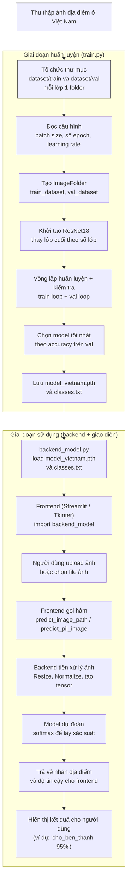
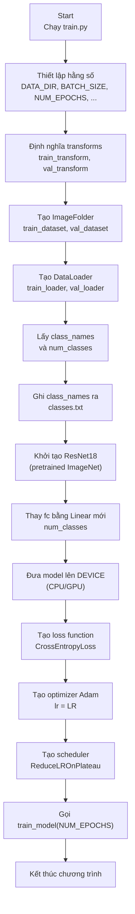
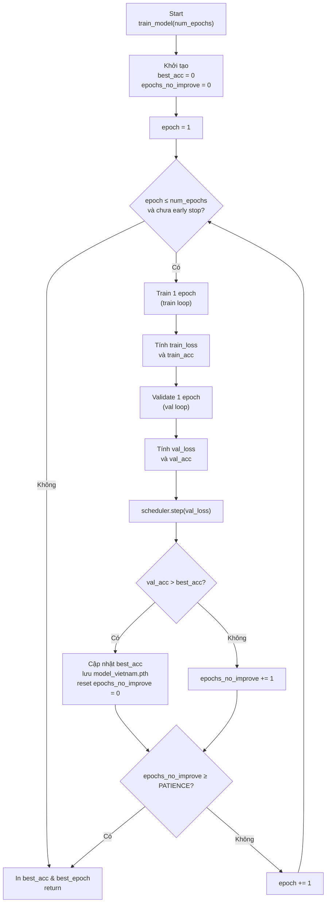
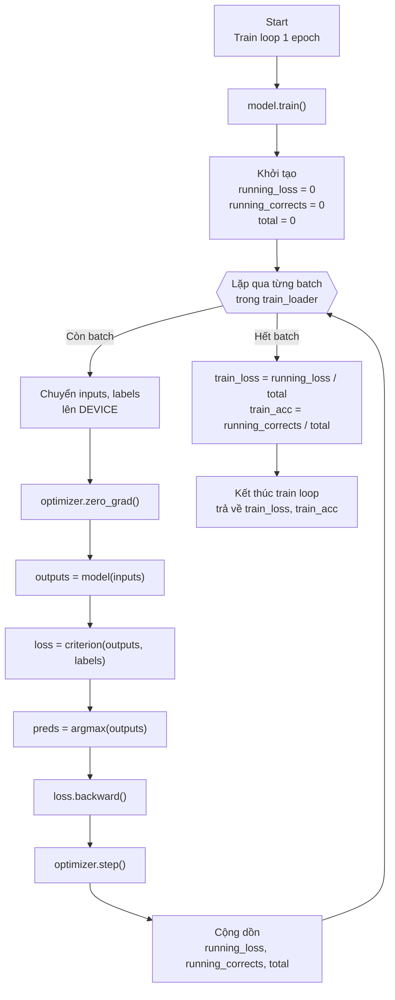
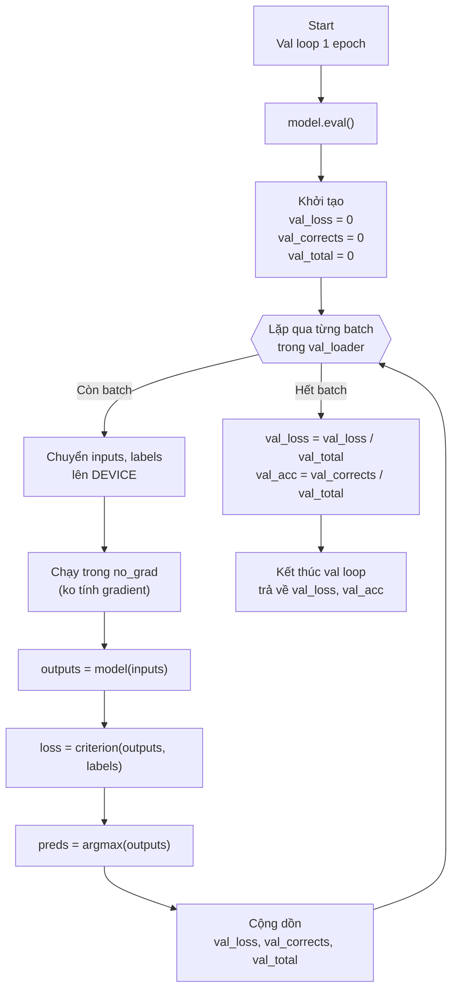
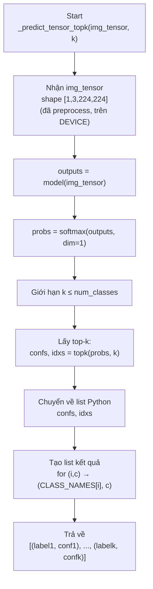
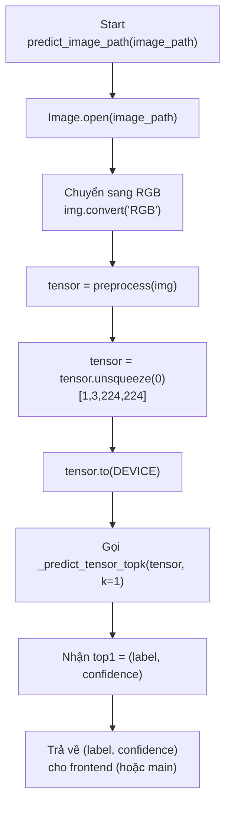
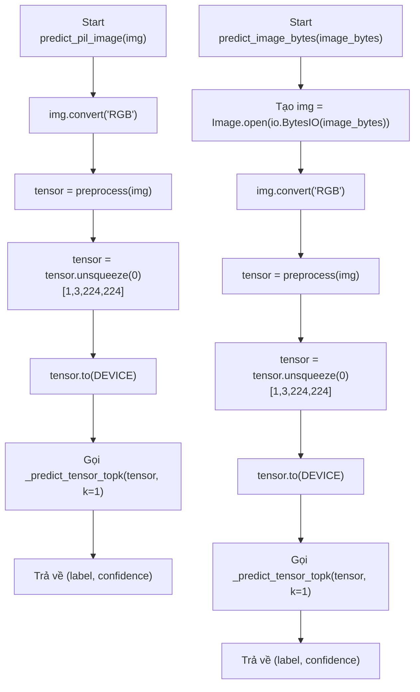
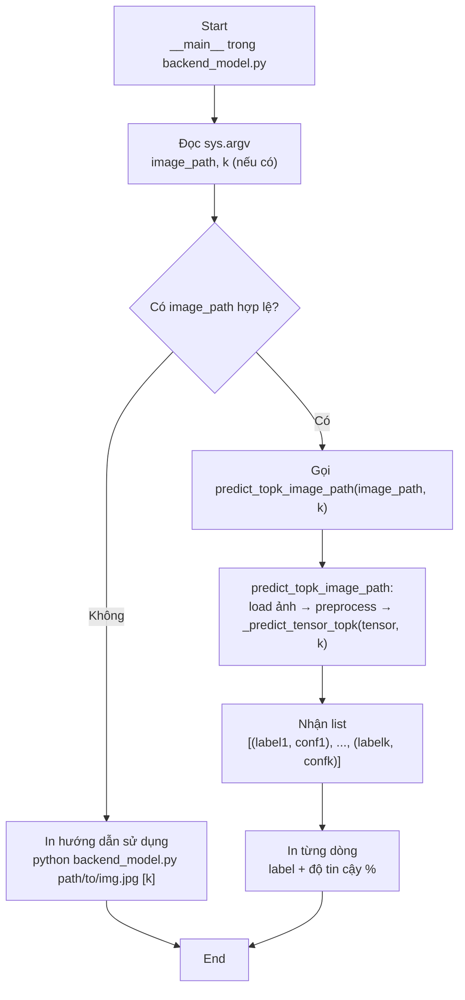

## Sơ Đồ train.py và predict_vn.py
## Tổng quan 

## khởi tạo & gọi hàm train_model.

## hàm train_model.

## train loop

## val loop

## Sơ đồ predict_vn.py
## hàm core_predict_tensor_topk

## hàm predict_image_path

## hàm predict_pil_image và predict_image_bytes

## hàm predict_topk_*
