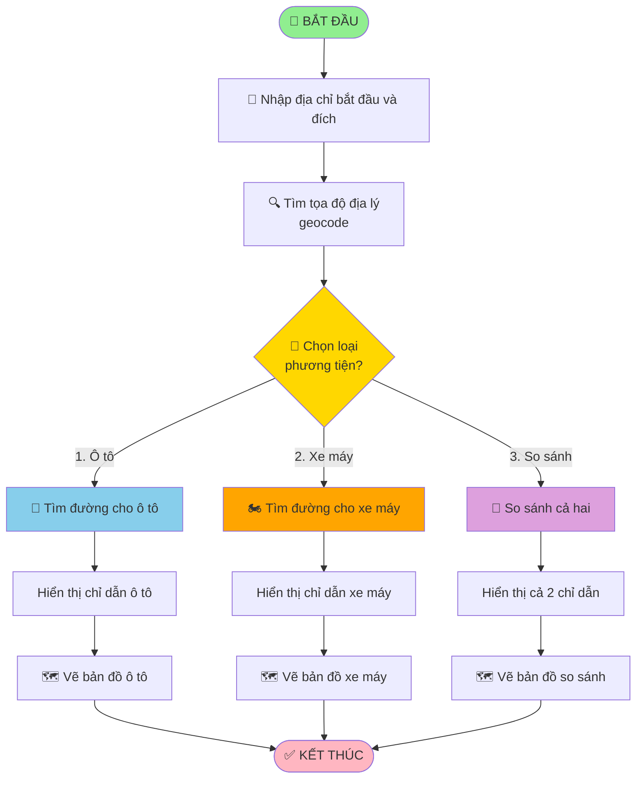
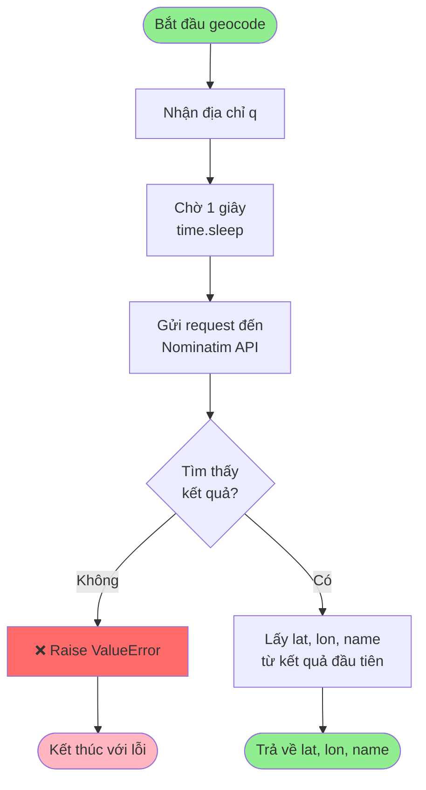
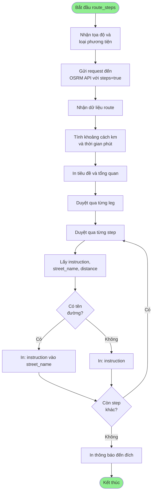
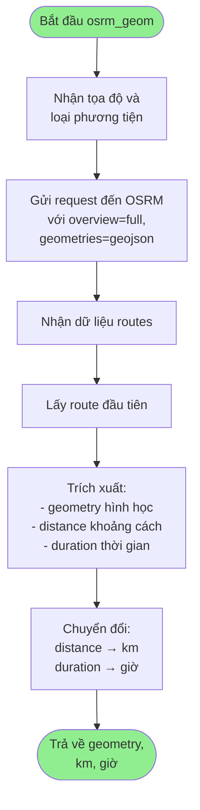
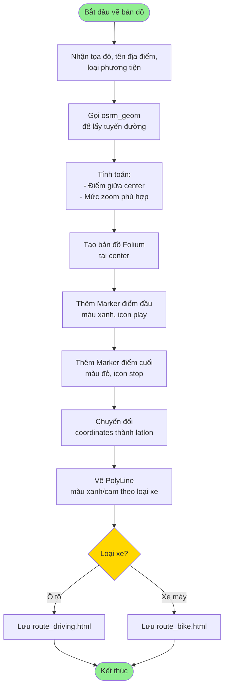
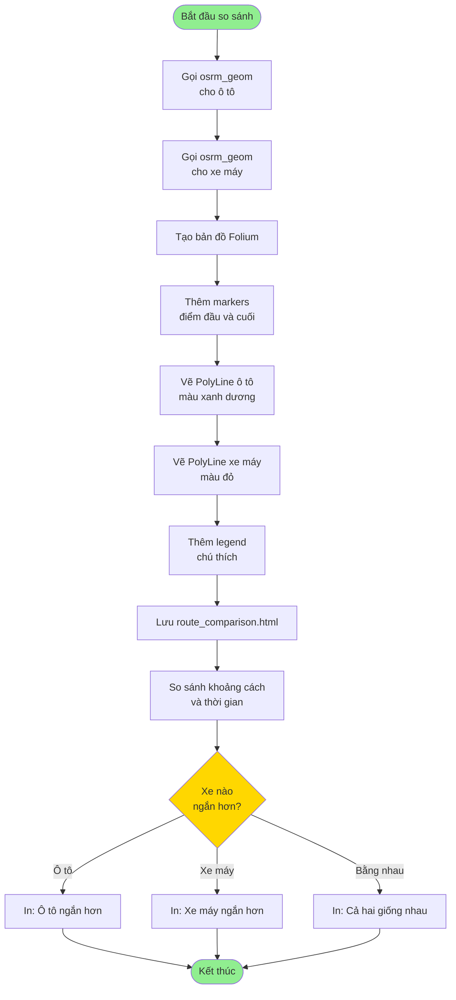
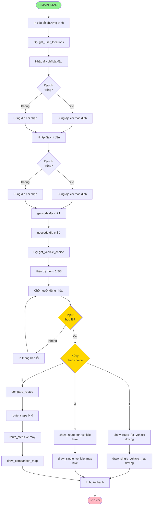
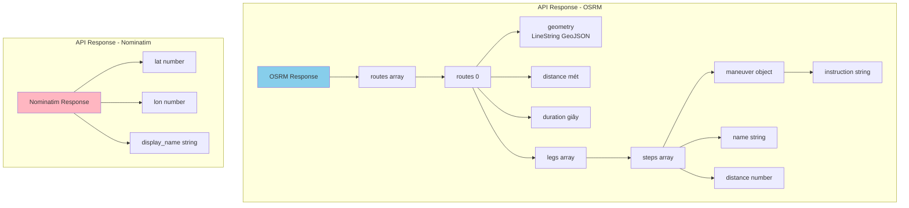

# Sơ đồ Chương Trình Tìm Đường Đi Ngắn Nhất

## Sơ đồ Tổng Quan Chương Trình

## Sơ đồ Chi Tiết Hàm geocode()

## Sơ đồ Chi Tiết Hàm route_steps()

## Sơ đồ Chi Tiết Hàm osrm_geom()

## Sơ đồ Vẽ Bản Đồ Đơn (draw_single_vehicle_map)

## Sơ đồ Vẽ Bản Đồ So Sánh (draw_comparison_map)

## Sơ đồ Luồng Chính (Main Flow)

## Sơ đồ Cấu Trúc Dữ Liệu

## Ghi Chú

### Các API Sử Dụng:
- **Nominatim**: `https://nominatim.openstreetmap.org` - Geocoding
- **OSRM**: `https://router.project-osrm.org` - Routing

### Các Loại Phương Tiện:
- `driving`: Ô tô (đường ô tô, cao tốc)
- `bike`: Xe máy/xe đạp (có thể đi đường hẹp)

### Các File Output:
- `route_driving.html`: Bản đồ ô tô
- `route_bike.html`: Bản đồ xe máy
- `route_comparison.html`: Bản đồ so sánh

### Các Hàm Chính:

| Hàm | Mô tả | Input | Output |
|-----|-------|-------|--------|
| `geocode(q)` | Tìm tọa độ từ địa chỉ | Địa chỉ (string) | lat, lon, name |
| `osrm_geom()` | Lấy hình học tuyến đường | Tọa độ, loại xe | geometry, km, giờ |
| `route_steps()` | Hiển thị chỉ dẫn chi tiết | Tọa độ, loại xe | None (in ra) |
| `get_vehicle_choice()` | Menu chọn xe | None | "driving"/"bike"/"both" |
| `get_user_locations()` | Nhập địa chỉ | None | lat1, lon1, name1, lat2, lon2, name2 |
| `show_route_for_vehicle()` | Hiển thị và vẽ cho 1 xe | Tọa độ, tên, loại xe | None |
| `compare_routes()` | So sánh 2 loại xe | Tọa độ, tên | None |
| `draw_single_vehicle_map()` | Vẽ bản đồ 1 xe | Tọa độ, tên, loại xe | File HTML |
| `draw_comparison_map()` | Vẽ bản đồ so sánh | Tọa độ, tên | File HTML |
